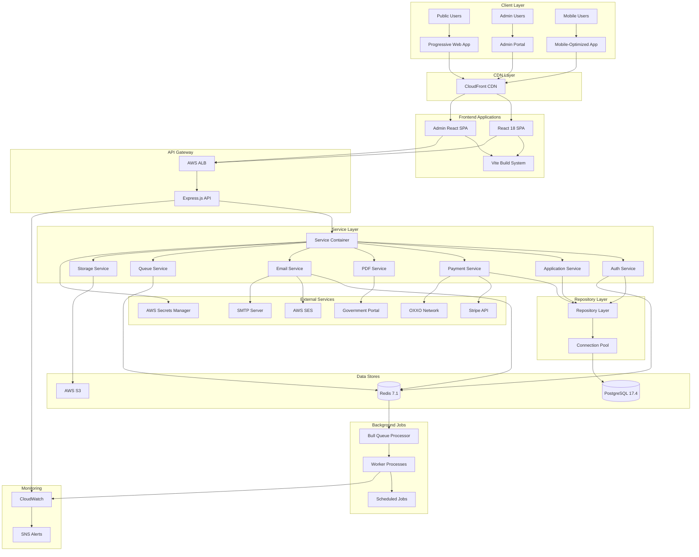

# Permisos Digitales - System Architecture Documentation

**Version**: 3.0  
**Last Updated**: June 2025  
**Status**: Production Implementation

## Executive Summary

Permisos Digitales is a comprehensive vehicle permit management system built with a modern, scalable architecture. The system processes permit applications, handles payments through Stripe (including OXXO), automates government portal interactions, and delivers digital permits to users.

## Table of Contents

1. [System Overview](#system-overview)
2. [Architecture Diagram](#architecture-diagram)
3. [Technology Stack](#technology-stack)
4. [Component Architecture](#component-architecture)
5. [Data Architecture](#data-architecture)
6. [Integration Architecture](#integration-architecture)
7. [Security Architecture](#security-architecture)
8. [Performance & Scalability](#performance--scalability)
9. [Deployment Architecture](#deployment-architecture)
10. [Monitoring & Observability](#monitoring--observability)

## System Overview

### Core Business Functions
- User registration and authentication
- Vehicle permit application processing
- Payment processing (Credit/Debit cards and OXXO)
- Automated government portal interaction
- PDF permit generation and delivery
- Admin portal for system management

### Key Architectural Principles
- **Layered Architecture**: Clear separation of concerns
- **Security First**: Multiple security layers throughout
- **High Availability**: Fault-tolerant design with fallbacks
- **Scalability**: Horizontal scaling capabilities
- **Maintainability**: Modular, well-documented code
- **Performance**: Optimized for Mexican market conditions

## Architecture Diagram



## Technology Stack

### Frontend Stack
| Component | Technology | Version | Purpose |
|-----------|------------|---------|---------|
| Framework | React | 18.3.1 | UI framework |
| Language | TypeScript | 5.6.2 | Type safety |
| Build Tool | Vite | 6.0.7 | Fast builds |
| Routing | React Router | 7.1.2 | SPA routing |
| State Management | React Query | 5.x | Server state |
| Forms | React Hook Form | 7.x | Form handling |
| Validation | Zod | 3.x | Schema validation |
| Styling | CSS Modules | - | Component styles |
| Payment | Stripe Elements | Latest | Secure payments |
| Testing | Vitest + Playwright | Latest | Unit & E2E tests |

### Backend Stack
| Component | Technology | Version | Purpose |
|-----------|------------|---------|---------|
| Runtime | Node.js | 18+ | Server runtime |
| Framework | Express.js | 4.21.2 | Web framework |
| Database | PostgreSQL | 17.4 | Primary data store |
| Cache/Queue | Redis | 7.1.0 | Sessions & queues |
| Queue Manager | Bull | 4.x | Job processing |
| PDF Generation | Puppeteer | 24.2.0 | Browser automation |
| Authentication | express-session | 1.18.1 | Session management |
| Validation | Joi | 17.x | Config validation |
| Email | Nodemailer | 6.x | Email sending |
| Payment | Stripe SDK | 17.6.0 | Payment processing |
| Security | Helmet | 8.0.0 | Security headers |
| Logging | Winston | 3.x | Structured logging |

### Infrastructure
| Component | Service | Configuration |
|-----------|---------|---------------|
| Compute | EC2 t3.small | Node.js application |
| Database | RDS PostgreSQL | db.t3.micro, 20GB |
| Cache | ElastiCache Redis | cache.t3.micro |
| Storage | S3 | Document storage |
| CDN | CloudFront | Static assets |
| DNS | Route53 | Domain management |
| SSL | ACM | SSL certificates |
| Secrets | Secrets Manager | Credential storage |
| Email | SES | Transactional email |
| Monitoring | CloudWatch | Logs & metrics |

## Component Architecture

### Backend Layer Structure

```
src/
├── bootstrap/              # Application initialization
│   └── service-initializer.js
├── config/                 # Configuration management
│   ├── unified-config.js   # Centralized config (801 lines)
│   ├── secrets/           # Secrets management
│   └── v2/                # Legacy config support
├── constants/             # Application constants
├── controllers/           # Request handlers
│   ├── admin.controller.js
│   ├── application.controller.js
│   ├── auth.controller.js
│   ├── payment.controller.js
│   ├── stripe-payment.controller.js
│   └── ses-webhook.controller.js
├── db/                    # Database layer
│   ├── index.js          # Connection pool
│   └── migrations/       # Schema migrations
├── jobs/                  # Background jobs
│   ├── application-cleanup.job.js
│   ├── payment-reconciliation.job.js
│   ├── permit-expiration-notifications.js
│   └── scheduler.js
├── middleware/            # Express middleware
│   ├── auth.middleware.js
│   ├── cors.middleware.js
│   ├── payment-security.middleware.js
│   ├── rate-limiting.middleware.js
│   └── security.middleware.js
├── monitoring/            # Health & metrics
├── repositories/          # Data access layer
│   ├── base.repository.js # Base class
│   ├── application.repository.js
│   ├── payment.repository.js
│   └── user.repository.js
├── routes/                # API endpoints
├── scripts/               # Utility scripts
├── services/              # Business logic
│   ├── container/         # Service container
│   ├── secrets/          # Secrets service
│   └── storage/          # Storage providers
├── templates/            # Email templates
├── types/                # TypeScript types
├── utils/                # Utilities
└── views/                # EJS templates
```

### Frontend Layer Structure

```
frontend/src/
├── admin/                 # Admin portal SPA
│   ├── components/
│   ├── pages/
│   └── services/
├── components/            # Shared components
│   ├── auth/             # Authentication
│   ├── dashboard/        # Dashboard widgets
│   ├── forms/            # Form components
│   ├── navigation/       # Navigation
│   ├── payment/          # Payment flows
│   ├── permits/          # Permit displays
│   └── ui/               # UI components
├── config/               # Frontend config
├── contexts/             # React contexts
│   ├── AuthContext.tsx
│   ├── AdminAuthContext.tsx
│   └── StripeContext.tsx
├── hooks/                # Custom hooks
│   ├── useMediaQuery.ts
│   ├── usePermitDetails.ts
│   └── useQueueStatus.ts
├── layouts/              # Page layouts
├── pages/                # Route pages
│   ├── DesignSystemV3/   # Design system
│   ├── Mobile*Pages.tsx  # Mobile-specific
│   └── *Page.tsx         # Desktop pages
├── services/             # API clients
│   ├── api.ts
│   ├── applicationService.ts
│   ├── paymentService.ts
│   └── stripePaymentService.ts
├── shared/               # Shared resources
├── styles/               # Global styles
├── types/                # TypeScript types
└── utils/                # Utilities
```

### Key Design Patterns

#### 1. Service Container Pattern
```javascript
// Dependency injection and lifecycle management
class ServiceContainer {
  constructor() {
    this.services = new Map();
    this.initialized = false;
  }
  
  register(name, factory, dependencies = []) {
    this.services.set(name, {
      factory,
      dependencies,
      instance: null,
      initializing: false
    });
  }
  
  async initialize() {
    // Topological sort for dependency resolution
    const sortedServices = this.topologicalSort();
    for (const serviceName of sortedServices) {
      await this.initializeService(serviceName);
    }
  }
}
```

#### 2. Repository Pattern
```javascript
class BaseRepository {
  constructor(tableName) {
    this.tableName = tableName;
    this.db = require('../db');
  }
  
  async findById(id, client = null) {
    const db = client || this.db;
    const result = await db.query(
      `SELECT * FROM ${this.tableName} WHERE id = $1`,
      [id]
    );
    return result.rows[0];
  }
  
  async withTransaction(callback) {
    const client = await this.db.getClient();
    try {
      await client.query('BEGIN');
      const result = await callback(client);
      await client.query('COMMIT');
      return result;
    } catch (error) {
      await client.query('ROLLBACK');
      throw error;
    } finally {
      client.release();
    }
  }
}
```

#### 3. Provider Pattern
```javascript
// Storage provider interface
class StorageProvider {
  async upload(file, key) {
    throw new Error('Must implement upload method');
  }
  
  async download(key) {
    throw new Error('Must implement download method');
  }
  
  async delete(key) {
    throw new Error('Must implement delete method');
  }
}

// S3 implementation
class S3StorageProvider extends StorageProvider {
  async upload(file, key) {
    // S3 upload logic
  }
}

// Local implementation
class LocalStorageProvider extends StorageProvider {
  async upload(file, key) {
    // Local filesystem logic
  }
}
```

#### 4. Circuit Breaker Pattern
```javascript
class CircuitBreaker {
  constructor(options) {
    this.failureThreshold = options.failureThreshold || 3;
    this.resetTimeout = options.resetTimeout || 60000;
    this.state = 'CLOSED';
    this.failures = 0;
  }
  
  async execute(operation) {
    if (this.state === 'OPEN') {
      throw new Error('Circuit breaker is OPEN');
    }
    
    try {
      const result = await operation();
      this.onSuccess();
      return result;
    } catch (error) {
      this.onFailure();
      throw error;
    }
  }
}
```

## Data Architecture

### Database Schema

```sql
-- Core Tables
CREATE TABLE users (
    id UUID PRIMARY KEY DEFAULT gen_random_uuid(),
    email VARCHAR(255) UNIQUE NOT NULL,
    password_hash VARCHAR(255) NOT NULL,
    first_name VARCHAR(100) NOT NULL,
    last_name VARCHAR(100) NOT NULL,
    phone VARCHAR(20),
    role VARCHAR(20) DEFAULT 'client',
    is_email_verified BOOLEAN DEFAULT false,
    is_enabled BOOLEAN DEFAULT true,
    account_status VARCHAR(20) DEFAULT 'active',
    failed_login_attempts INTEGER DEFAULT 0,
    last_failed_login TIMESTAMP,
    created_at TIMESTAMP DEFAULT CURRENT_TIMESTAMP,
    updated_at TIMESTAMP DEFAULT CURRENT_TIMESTAMP
);

CREATE TABLE permit_applications (
    id UUID PRIMARY KEY DEFAULT gen_random_uuid(),
    user_id UUID REFERENCES users(id),
    status VARCHAR(50) NOT NULL,
    -- Personal Information
    email VARCHAR(255) NOT NULL,
    first_name VARCHAR(100) NOT NULL,
    last_name VARCHAR(100) NOT NULL,
    maternal_surname VARCHAR(100),
    curp VARCHAR(18),
    -- Vehicle Information
    plates VARCHAR(20) NOT NULL,
    marca VARCHAR(50) NOT NULL,
    linea VARCHAR(50) NOT NULL,
    tipo_servicio VARCHAR(50) NOT NULL,
    ano_modelo INTEGER NOT NULL,
    -- Payment Information
    importe DECIMAL(10,2),
    stripe_payment_intent_id VARCHAR(255),
    payment_method VARCHAR(20),
    -- PDF Keys
    permit_s3_key VARCHAR(500),
    certificate_s3_key VARCHAR(500),
    plate_s3_key VARCHAR(500),
    -- Timestamps
    payment_initiated_at TIMESTAMP,
    expires_at TIMESTAMP,
    created_at TIMESTAMP DEFAULT CURRENT_TIMESTAMP,
    updated_at TIMESTAMP DEFAULT CURRENT_TIMESTAMP
);

CREATE TABLE payment_events (
    id UUID PRIMARY KEY DEFAULT gen_random_uuid(),
    application_id UUID REFERENCES permit_applications(id),
    event_type VARCHAR(50) NOT NULL,
    payment_intent_id VARCHAR(255),
    amount DECIMAL(10,2),
    currency VARCHAR(3) DEFAULT 'MXN',
    status VARCHAR(50),
    metadata JSONB,
    created_at TIMESTAMP DEFAULT CURRENT_TIMESTAMP
);

-- Indexes for Performance
CREATE INDEX idx_users_email ON users(email);
CREATE INDEX idx_applications_user_id ON permit_applications(user_id);
CREATE INDEX idx_applications_status ON permit_applications(status);
CREATE INDEX idx_applications_expires_at ON permit_applications(expires_at);
CREATE INDEX idx_payment_events_application_id ON payment_events(application_id);
CREATE INDEX idx_payment_events_intent_id ON payment_events(payment_intent_id);
```

### Redis Data Structures

```javascript
// Session Storage
session:{sessionId} = {
  cookie: { ... },
  user: { id, email, role },
  csrfSecret: "...",
  lastActivity: timestamp
}

// Rate Limiting
rate_limit:{userId}:{endpoint} = count
rate_limit:ip:{ip}:{endpoint} = count

// Account Lockout
lockout:{email} = {
  attempts: number,
  lockedUntil: timestamp
}

// Queue Management
bull:pdf_generation:waiting = [...]
bull:pdf_generation:active = [...]
bull:pdf_generation:completed = [...]
bull:pdf_generation:failed = [...]

// Application Cache
cache:app:{applicationId} = {
  // Cached application data
}
```

## Integration Architecture

### Payment Integration (Stripe)

```javascript
// Payment Flow
1. Create Customer → Stripe API
2. Create Payment Intent → Stripe API
3. Collect Payment Details → Stripe.js (Frontend)
4. Confirm Payment → Stripe API
5. Handle Webhook → Verify Signature → Process Event

// Supported Payment Methods
- Credit/Debit Cards (Visa, MC, Amex)
- OXXO Cash Payments (3-day window)

// Webhook Events Processed
- payment_intent.created
- payment_intent.succeeded
- payment_intent.payment_failed
- payment_intent.requires_action
- charge.updated (OXXO confirmations)
```

### Government Portal Integration

```javascript
// PDF Generation Flow
1. Queue Job Created
2. Launch Puppeteer Browser
3. Navigate to Government Portal
4. Fill Application Forms
5. Submit and Wait for PDFs
6. Download Generated PDFs
7. Upload to S3
8. Update Application Record
```

### AWS Services Integration

#### S3 Storage
```javascript
// Document Storage Structure
s3://bucket/permits/{applicationId}/
  ├── permiso_{timestamp}.pdf
  ├── certificado_{timestamp}.pdf
  └── placas_{timestamp}.pdf
```

#### Secrets Manager
```javascript
// Secret Structure
permisos/production/database/credentials
permisos/production/redis/credentials
permisos/production/security/secrets
permisos/production/stripe/api-keys
permisos/production/email/credentials
permisos/production/government/portal
```

## Security Architecture

### Authentication & Authorization

```javascript
// Session-Based Authentication
1. User Login → Validate Credentials
2. Generate Session → Store in PostgreSQL
3. Set Secure Cookie → HttpOnly, Secure, SameSite
4. CSRF Token → Double Submit Cookie
5. Session Validation → Each Request

// Role-Based Access Control
- client: Regular users
- admin: System administrators
- superadmin: Full system access
```

### Security Layers

1. **Network Security**
   - HTTPS everywhere (TLS 1.2+)
   - AWS Security Groups
   - CloudFront for DDoS protection

2. **Application Security**
   - Helmet.js security headers
   - CORS configuration
   - Rate limiting per endpoint
   - Input validation & sanitization
   - SQL injection prevention
   - XSS protection

3. **Data Security**
   - Encryption at rest (RDS, S3)
   - Encryption in transit (TLS)
   - Password hashing (bcrypt)
   - Sensitive data masking in logs

4. **Payment Security**
   - PCI compliance via Stripe.js
   - No card data storage
   - Webhook signature verification
   - Payment velocity monitoring

### Security Monitoring

```javascript
// Security Events Tracked
- Failed login attempts
- Account lockouts
- Suspicious payment patterns
- Invalid webhook attempts
- Rate limit violations
```

## Performance & Scalability

### Performance Optimizations

1. **Database**
   - Connection pooling (2-10 connections)
   - Optimized indexes
   - Query optimization
   - Prepared statements

2. **Caching**
   - Redis for sessions
   - Application data caching
   - Static asset caching (CloudFront)
   - API response caching

3. **Frontend**
   - Code splitting
   - Lazy loading
   - Tree shaking
   - Image optimization
   - Memory management utilities

4. **Backend**
   - Async/await patterns
   - Stream processing
   - Queue-based processing
   - Circuit breakers

### Scalability Strategy

```javascript
// Horizontal Scaling
- Stateless application servers
- Session storage in Redis
- Queue-based job processing
- Database read replicas (future)

// Vertical Scaling
- Auto-scaling groups (future)
- Load balancer health checks
- Graceful shutdown handling
```

## Deployment Architecture

### AWS Infrastructure

```yaml
Region: us-east-1
VPC: Default VPC
Availability Zones: us-east-1a, us-east-1b

EC2:
  Instance: t3.small
  OS: Amazon Linux 2
  Runtime: Node.js 18 via PM2

RDS:
  Engine: PostgreSQL 17.4
  Instance: db.t3.micro
  Storage: 20GB GP2
  Backup: 7 days retention

ElastiCache:
  Engine: Redis 7.1.0
  Instance: cache.t3.micro
  Mode: Single node

S3 Buckets:
  - permisos-digitales-frontend-east (Static hosting)
  - permisos-digitales-files-east (Document storage)

CloudFront:
  Origin: S3 bucket
  Behaviors: SPA routing
  Caching: Optimized
```

### Deployment Process

```bash
# Backend Deployment
1. Build application
2. Run tests
3. Upload to EC2
4. Run database migrations
5. Restart PM2 processes
6. Verify health checks

# Frontend Deployment
1. Build with Vite
2. Upload to S3
3. Invalidate CloudFront cache
4. Verify deployment
```

## Monitoring & Observability

### Health Checks

```javascript
// Comprehensive Health Endpoint
GET /health
{
  status: "healthy|degraded|unhealthy",
  version: "1.0.0",
  uptime: 3600,
  services: {
    database: { status: "healthy", responseTime: 5 },
    redis: { status: "healthy", responseTime: 1 },
    s3: { status: "healthy", responseTime: 50 },
    stripe: { status: "healthy", responseTime: 200 }
  },
  queues: {
    pdfGeneration: { waiting: 0, active: 1, completed: 150 }
  }
}
```

### Metrics & Monitoring

1. **Application Metrics**
   - Request rate & latency
   - Error rates by endpoint
   - Active sessions
   - Queue depths

2. **Business Metrics**
   - Applications created
   - Payments processed
   - PDFs generated
   - User registrations

3. **Infrastructure Metrics**
   - CPU & memory usage
   - Database connections
   - Disk usage
   - Network traffic

### Alerting

```javascript
// CloudWatch Alarms
- High error rate (> 5%)
- API latency (> 3s)
- Queue backup (> 100 jobs)
- Database connection failures
- Payment processing failures

// Notification Channels
- SNS → Email
- SNS → Slack (webhook)
- CloudWatch Dashboard
```

## Disaster Recovery

### Backup Strategy
- **Database**: Daily automated backups, 7-day retention
- **S3 Documents**: Versioning enabled, cross-region replication
- **Code**: Git repository with tagged releases
- **Secrets**: AWS Secrets Manager with backup

### Recovery Procedures
1. **Database Failure**: Restore from latest snapshot
2. **Application Failure**: Redeploy from Git
3. **Redis Failure**: Graceful degradation, rebuild cache
4. **S3 Failure**: Failover to backup region

### RTO/RPO Targets
- **RTO** (Recovery Time Objective): 4 hours
- **RPO** (Recovery Point Objective): 24 hours

## Future Enhancements

1. **Microservices Migration**
   - Extract payment service
   - Extract PDF generation service
   - Extract notification service

2. **Performance Improvements**
   - Database read replicas
   - Multi-region deployment
   - Edge computing for PDFs

3. **Feature Additions**
   - Real-time notifications
   - Mobile native apps
   - Advanced analytics dashboard

---

**Document Version**: 3.0  
**Last Architecture Review**: June 2025  
**Next Review**: September 2025  
**Maintained By**: Engineering Team