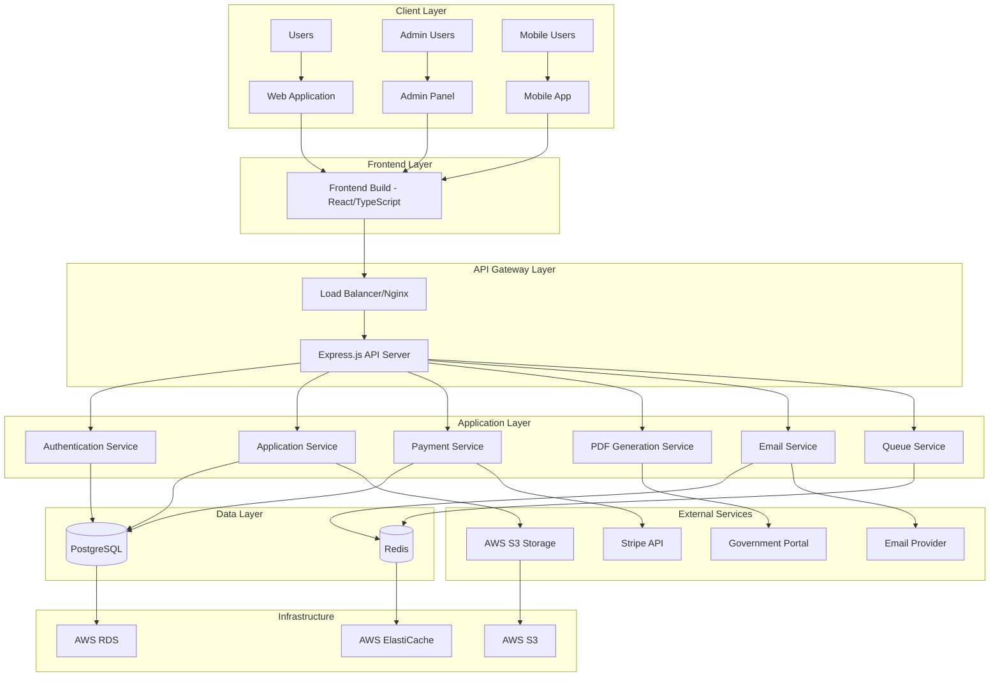
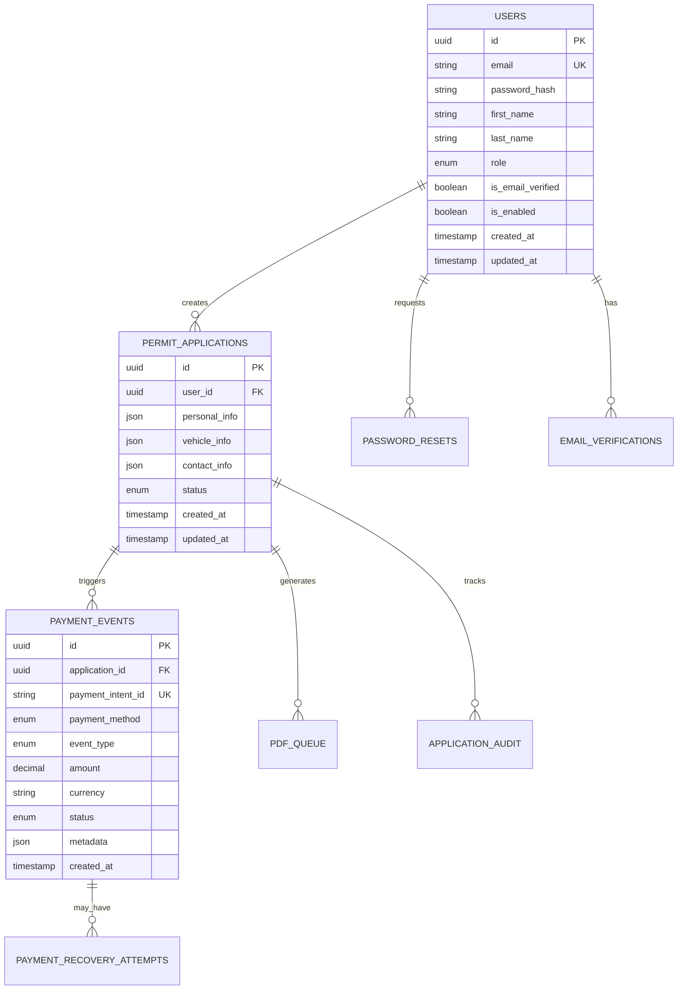
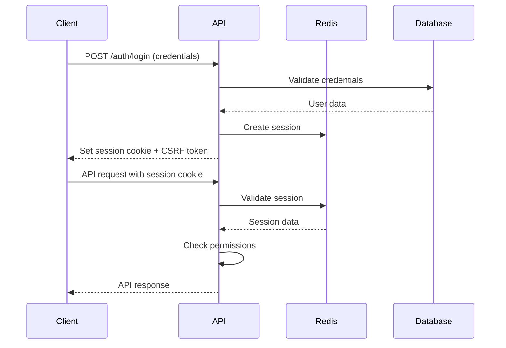
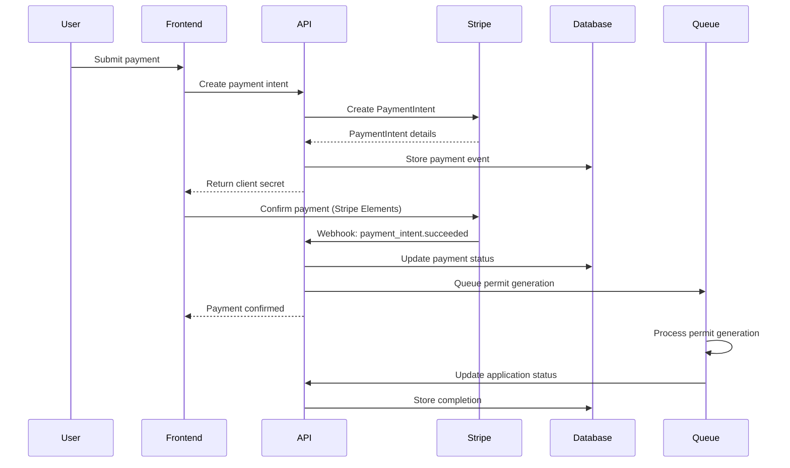
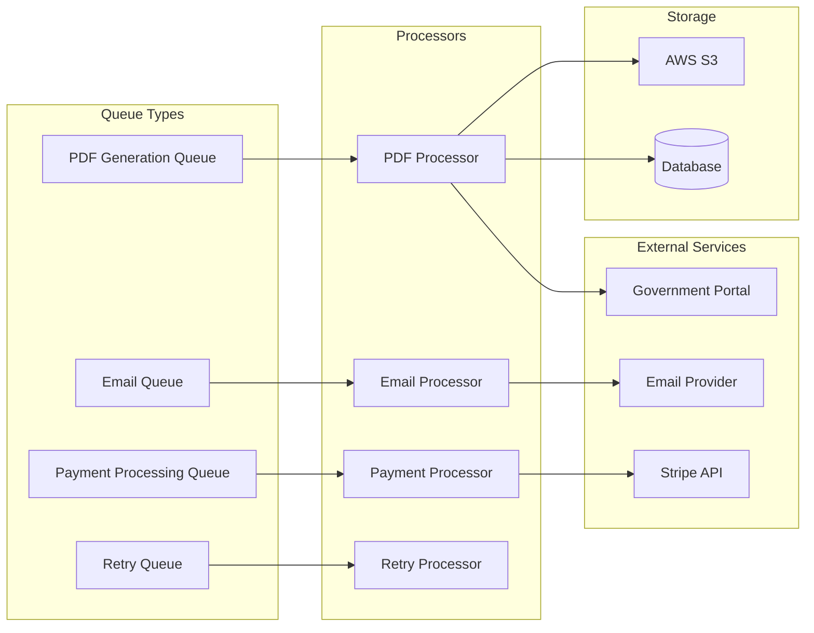

# Architecture Overview

Comprehensive overview of the Permisos Digitales system architecture, design decisions, and technical implementation.

## System Architecture

### High-Level Architecture



### Technology Stack

#### Backend Infrastructure
- **Runtime**: Node.js 18+ with Express.js framework
- **Database**: PostgreSQL 13+ with connection pooling
- **Cache**: Redis 6+ for sessions, rate limiting, and queue management
- **File Storage**: AWS S3 with local filesystem fallback
- **Process Management**: PM2 with cluster mode for production
- **Queue Processing**: Bull/Redis for background job management

#### Frontend Architecture
- **Framework**: React 18 with TypeScript and strict mode
- **Build Tool**: Vite with hot module replacement and optimized bundling
- **Styling**: CSS Modules with CSS custom properties
- **State Management**: React Context with useReducer patterns
- **Routing**: React Router v7 with protected routes
- **Forms**: React Hook Form with Zod validation

#### Infrastructure & Security
- **Monitoring**: Custom metrics with health checks and alerting
- **Logging**: Winston with structured logging and log rotation
- **Security**: Helmet.js, CSRF protection, rate limiting, input validation

---

## Application Architecture

### Layered Architecture Pattern

#### 1. Presentation Layer (Frontend)
```
frontend/src/
├── pages/           # Route components and page views
├── components/      # Reusable UI components
├── layouts/         # Page layout components
├── services/        # API service layer
├── contexts/        # React Context providers
├── hooks/           # Custom React hooks
├── utils/           # Utility functions
└── types/           # TypeScript type definitions
```

#### 2. API Layer (Backend Routes)
```
src/routes/
├── auth.routes.js        # Authentication endpoints
├── applications.routes.js # Permit application management
├── payment.routes.js     # Payment processing
├── admin.routes.js       # Administrative functions
├── health.routes.js      # Health checks and monitoring
└── index.js             # Route aggregation
```

#### 3. Business Logic Layer (Services)
```
src/services/
├── auth-security.service.js      # Authentication & security
├── application.service.js        # Application processing
├── payment.service.js           # Payment orchestration
├── pdf-service.js               # Document generation
├── email.service.js             # Email notifications
├── storage.service.js           # File storage abstraction
└── queue.service.js             # Background job processing
```

#### 4. Data Access Layer (Repositories)
```
src/repositories/
├── base.repository.js           # Base repository pattern
├── user.repository.js           # User data access
├── application.repository.js    # Application data access
├── payment.repository.js        # Payment data access
└── security.repository.js       # Security audit data
```

#### 5. Infrastructure Layer
```
src/
├── config/          # Configuration management
├── middleware/      # Express middleware
├── utils/           # Utility functions
├── db/              # Database connections and migrations
└── monitoring/      # Health checks and metrics
```

### Design Patterns

#### Repository Pattern
```javascript
// Base repository with common operations
class BaseRepository {
  constructor(tableName) {
    this.tableName = tableName;
    this.db = require('../db');
  }
  
  async findById(id) {
    const result = await this.db.query(
      `SELECT * FROM ${this.tableName} WHERE id = $1`,
      [id]
    );
    return result.rows[0];
  }
  
  async create(data) {
    // Common create logic
  }
}

// Specific repository implementation
class UserRepository extends BaseRepository {
  constructor() {
    super('users');
  }
  
  async findByEmail(email) {
    const result = await this.db.query(
      'SELECT * FROM users WHERE email = $1',
      [email]
    );
    return result.rows[0];
  }
}
```

#### Service Layer Pattern
```javascript
// Service orchestrates business logic
class ApplicationService {
  constructor() {
    this.applicationRepo = new ApplicationRepository();
    this.paymentService = new PaymentService();
    this.pdfService = new PDFService();
    this.emailService = new EmailService();
  }
  
  async createApplication(userId, applicationData) {
    // 1. Validate data
    // 2. Create application record
    // 3. Initiate payment process
    // 4. Queue PDF generation
    // 5. Send confirmation email
  }
}
```

#### Factory Pattern
```javascript
// Storage provider factory
class StorageFactory {
  static create() {
    const storageType = process.env.STORAGE_TYPE || 'local';
    
    switch (storageType) {
      case 's3':
        return new S3StorageProvider();
      case 'local':
        return new LocalStorageProvider();
      default:
        throw new Error(`Unknown storage type: ${storageType}`);
    }
  }
}
```

---

## Data Architecture

### Database Design

#### Entity Relationship Overview


#### Database Tables

**Core Tables:**
- `users` - User account information
- `permit_applications` - Permit application data
- `payment_events` - Payment processing events
- `webhook_events` - External service webhooks
- `pdf_queue` - Document generation queue
- `failed_permits` - Failed permit recovery tracking

**Security & Audit:**
- `password_resets` - Password reset tokens
- `email_verifications` - Email verification tokens
- `session_store` - User sessions (Redis backup)
- `application_audit` - Application change tracking
- `security_events` - Security audit trail

#### Indexing Strategy
```sql
-- Performance indexes
CREATE INDEX idx_users_email ON users(email);
CREATE INDEX idx_applications_user_id ON permit_applications(user_id);
CREATE INDEX idx_applications_status ON permit_applications(status);
CREATE INDEX idx_payment_events_application_id ON payment_events(application_id);
CREATE INDEX idx_payment_events_intent_id ON payment_events(payment_intent_id);
CREATE INDEX idx_payment_events_created_at ON payment_events(created_at);

-- Composite indexes
CREATE INDEX idx_applications_user_status ON permit_applications(user_id, status);
CREATE INDEX idx_payments_app_status ON payment_events(application_id, status);
```

### Caching Strategy

#### Redis Usage
```javascript
// Session management
session:{sessionId} = {
  userId: 'uuid',
  role: 'client',
  lastActivity: timestamp,
  csrfToken: 'token'
}

// Rate limiting
rate_limit:{ip}:{endpoint} = {
  count: number,
  resetTime: timestamp
}

// Queue management
bull:pdf_generation = {
  waiting: [...jobs],
  active: [...jobs],
  completed: [...jobs],
  failed: [...jobs]
}

// Application cache
app:{applicationId} = {
  status: 'pending',
  lastUpdated: timestamp,
  // ... application data
}
```

---

## Security Architecture

### Authentication & Authorization

#### Session-Based Authentication


#### CSRF Protection
```javascript
// CSRF token generation and validation
app.use(csrf({
  cookie: {
    httpOnly: true,
    secure: process.env.NODE_ENV === 'production',
    sameSite: 'strict'
  },
  value: (req) => {
    return req.headers['x-csrf-token'] || req.body._csrf;
  }
}));
```

#### Role-Based Access Control (RBAC)
```javascript
// Permission middleware
const requireRole = (roles) => {
  return (req, res, next) => {
    if (!req.user) {
      return res.status(401).json({ error: 'Authentication required' });
    }
    
    if (!roles.includes(req.user.role)) {
      return res.status(403).json({ error: 'Insufficient permissions' });
    }
    
    next();
  };
};

// Usage
app.get('/admin/users', requireRole(['admin']), getUsersHandler);
```

### Data Protection

#### Input Validation & Sanitization
```javascript
// Comprehensive validation using express-validator
const validateApplication = [
  body('personalInfo.email')
    .isEmail()
    .normalizeEmail()
    .escape(),
  body('personalInfo.firstName')
    .isLength({ min: 2, max: 50 })
    .matches(/^[A-Za-zÀ-ÿ\s]+$/)
    .escape(),
  body('vehicleInfo.plates')
    .matches(/^[A-Z0-9]{6,8}$/)
    .escape(),
  // ... more validations
];
```

#### SQL Injection Prevention
```javascript
// Parameterized queries only
const getUserById = async (id) => {
  const result = await db.query(
    'SELECT * FROM users WHERE id = $1',
    [id] // Parameterized - prevents SQL injection
  );
  return result.rows[0];
};
```

#### XSS Protection
```javascript
// Content Security Policy
app.use(helmet({
  contentSecurityPolicy: {
    directives: {
      defaultSrc: ["'self'"],
      scriptSrc: ["'self'", "'unsafe-inline'", "js.stripe.com"],
      styleSrc: ["'self'", "'unsafe-inline'"],
      imgSrc: ["'self'", "data:", "https:"],
      connectSrc: ["'self'", "api.stripe.com"]
    }
  }
}));
```

---

## Payment Architecture

### Payment Flow Design



### Payment Security

#### Webhook Signature Verification
```javascript
const verifyStripeWebhook = (req, res, next) => {
  const sig = req.headers['stripe-signature'];
  const endpointSecret = process.env.STRIPE_WEBHOOK_SECRET;
  
  try {
    const event = stripe.webhooks.constructEvent(
      req.body,
      sig,
      endpointSecret
    );
    req.stripeEvent = event;
    next();
  } catch (err) {
    console.error('Webhook signature verification failed:', err.message);
    return res.status(400).send(`Webhook Error: ${err.message}`);
  }
};
```

#### Payment Reconciliation
```javascript
// Automated payment reconciliation
class PaymentReconciliationService {
  async reconcilePayments() {
    // 1. Fetch unreconciled payments from last 24 hours
    // 2. Query Stripe for payment status
    // 3. Update local database if status differs
    // 4. Handle failed payments with retry logic
    // 5. Generate reconciliation report
  }
}
```

---

## Background Processing

### Queue Architecture



### Job Processing
```javascript
// PDF generation job
pdfQueue.process('generate-permit', async (job) => {
  const { applicationId } = job.data;
  
  try {
    // 1. Fetch application data
    const application = await applicationRepo.findById(applicationId);
    
    // 2. Generate PDFs using Puppeteer
    const pdfs = await pdfService.generatePermitDocuments(application);
    
    // 3. Upload to S3
    const uploadedFiles = await storageService.uploadMultiple(pdfs);
    
    // 4. Update application with file URLs
    await applicationRepo.updateFileUrls(applicationId, uploadedFiles);
    
    // 5. Send completion email
    await emailService.sendPermitReadyNotification(application.userId);
    
    return { success: true, files: uploadedFiles };
  } catch (error) {
    console.error('PDF generation failed:', error);
    throw error; // Bull will handle retry logic
  }
});
```

---

## Monitoring & Observability

### Health Check System

```javascript
// Comprehensive health checks
const healthChecks = {
  database: async () => {
    try {
      await db.query('SELECT 1');
      return { status: 'healthy' };
    } catch (error) {
      return { status: 'unhealthy', error: error.message };
    }
  },
  
  redis: async () => {
    try {
      await redis.ping();
      return { status: 'healthy' };
    } catch (error) {
      return { status: 'unhealthy', error: error.message };
    }
  },
  
  stripe: async () => {
    try {
      await stripe.charges.list({ limit: 1 });
      return { status: 'healthy' };
    } catch (error) {
      return { status: 'unhealthy', error: error.message };
    }
  }
};
```

### Metrics Collection

#### Business Metrics
```javascript
// Custom metrics tracking
const businessMetrics = {
  applicationsCreated: new Counter({
    name: 'applications_created_total',
    help: 'Total number of applications created'
  }),
  
  paymentsProcessed: new Counter({
    name: 'payments_processed_total',
    help: 'Total number of payments processed',
    labelNames: ['method', 'status']
  }),
  
  permitGenerationTime: new Histogram({
    name: 'permit_generation_duration_seconds',
    help: 'Time to generate permit documents',
    buckets: [1, 5, 10, 30, 60, 300]
  })
};
```

### Error Tracking & Alerting

```javascript
// Structured error handling
class ErrorHandler {
  static handle(error, req, res, next) {
    const errorId = uuid.v4();
    
    // Log error with context
    logger.error('Application error', {
      errorId,
      message: error.message,
      stack: error.stack,
      url: req.url,
      method: req.method,
      userId: req.user?.id,
      timestamp: new Date().toISOString()
    });
    
    // Send to monitoring service
    if (process.env.NODE_ENV === 'production') {
      monitoringService.captureError(error, {
        errorId,
        user: req.user,
        request: {
          url: req.url,
          method: req.method,
          headers: req.headers
        }
      });
    }
    
    // Return appropriate response
    res.status(error.statusCode || 500).json({
      success: false,
      error: {
        code: error.code || 'INTERNAL_ERROR',
        message: process.env.NODE_ENV === 'production' 
          ? 'An internal error occurred' 
          : error.message,
        errorId
      }
    });
  }
}
```

---

## Performance Optimization

### Database Optimization

#### Connection Pooling
```javascript
// Optimized database connection pool
const pool = new Pool({
  host: process.env.DB_HOST,
  port: process.env.DB_PORT,
  database: process.env.DB_NAME,
  user: process.env.DB_USER,
  password: process.env.DB_PASSWORD,
  max: 20,              // Maximum connections
  min: 5,               // Minimum connections
  idle: 30000,          // 30 seconds idle timeout
  acquire: 60000,       // 60 seconds acquire timeout
  evict: 1000,          // Check for idle connections every second
});
```

#### Query Optimization
```javascript
// Optimized queries with proper indexing
const getApplicationsWithPayments = async (userId, page = 1, limit = 20) => {
  const offset = (page - 1) * limit;
  
  // Single query with JOIN instead of N+1 queries
  const result = await db.query(`
    SELECT 
      a.id,
      a.status,
      a.created_at,
      p.status as payment_status,
      p.amount,
      p.currency
    FROM permit_applications a
    LEFT JOIN payment_events p ON a.id = p.application_id 
    WHERE a.user_id = $1
    ORDER BY a.created_at DESC
    LIMIT $2 OFFSET $3
  `, [userId, limit, offset]);
  
  return result.rows;
};
```

### Frontend Optimization

#### Bundle Optimization
```typescript
// vite.config.ts - Optimized build configuration
export default defineConfig({
  build: {
    rollupOptions: {
      output: {
        manualChunks: {
          vendor: ['react', 'react-dom', 'react-router-dom'],
          stripe: ['@stripe/stripe-js', '@stripe/react-stripe-js'],
          admin: ['./src/admin'],
          forms: ['react-hook-form', '@hookform/resolvers']
        }
      }
    },
    minify: 'terser',
    terserOptions: {
      compress: {
        drop_console: true,
        drop_debugger: true
      }
    }
  }
});
```

#### Lazy Loading
```tsx
// Component lazy loading with suspense
const AdminDashboard = lazy(() => import('@/admin/pages/DashboardPage'));
const PaymentFlow = lazy(() => import('@/components/payment/UnifiedPaymentFlow'));

const App = () => (
  <Suspense fallback={<LoadingSpinner />}>
    <Routes>
      <Route path="/admin" element={<AdminDashboard />} />
      <Route path="/payment" element={<PaymentFlow />} />
    </Routes>
  </Suspense>
);
```

---

## Scalability Considerations

### Horizontal Scaling

#### Load Balancing
```nginx
# nginx.conf - Load balancer configuration
upstream backend {
    least_conn;
    server app1:3001 max_fails=3 fail_timeout=30s;
    server app2:3001 max_fails=3 fail_timeout=30s;
    server app3:3001 max_fails=3 fail_timeout=30s;
}

server {
    listen 80;
    
    location /api {
        proxy_pass http://backend;
        proxy_set_header Host $host;
        proxy_set_header X-Real-IP $remote_addr;
        proxy_set_header X-Forwarded-For $proxy_add_x_forwarded_for;
        proxy_connect_timeout 30s;
        proxy_send_timeout 30s;
        proxy_read_timeout 30s;
    }
}
```

#### Database Scaling
```javascript
// Read replica configuration
const masterDB = new Pool({
  host: process.env.DB_MASTER_HOST,
  // ... master configuration
});

const replicaDB = new Pool({
  host: process.env.DB_REPLICA_HOST,
  // ... replica configuration
});

// Query routing
const executeQuery = async (query, params, readOnly = false) => {
  const db = readOnly ? replicaDB : masterDB;
  return db.query(query, params);
};
```

### Caching Strategy

#### Multi-Level Caching
```javascript
// Application-level caching
class CacheService {
  constructor() {
    this.redis = new Redis(process.env.REDIS_URL);
    this.memCache = new Map(); // In-memory cache for hot data
  }
  
  async get(key) {
    // 1. Check memory cache first
    if (this.memCache.has(key)) {
      return this.memCache.get(key);
    }
    
    // 2. Check Redis cache
    const redisValue = await this.redis.get(key);
    if (redisValue) {
      const value = JSON.parse(redisValue);
      this.memCache.set(key, value); // Populate memory cache
      return value;
    }
    
    return null;
  }
  
  async set(key, value, ttl = 3600) {
    // Set in both caches
    this.memCache.set(key, value);
    await this.redis.setex(key, ttl, JSON.stringify(value));
  }
}
```

---

## Future Architecture Considerations

### Microservices Migration Path

#### Service Extraction Strategy
1. **Phase 1**: Extract Payment Service
2. **Phase 2**: Extract PDF Generation Service  
3. **Phase 3**: Extract Email Service
4. **Phase 4**: Extract Authentication Service

#### Event-Driven Architecture
```javascript
// Event bus implementation for microservices
class EventBus {
  constructor() {
    this.redis = new Redis(process.env.REDIS_URL);
  }
  
  async publish(event, data) {
    await this.redis.publish(event, JSON.stringify({
      timestamp: new Date().toISOString(),
      data
    }));
  }
  
  subscribe(event, handler) {
    this.redis.subscribe(event);
    this.redis.on('message', (channel, message) => {
      if (channel === event) {
        const eventData = JSON.parse(message);
        handler(eventData);
      }
    });
  }
}

// Usage
eventBus.subscribe('payment.completed', async (event) => {
  await pdfService.generatePermit(event.data.applicationId);
});
```

### Cloud-Native Considerations

#### Service Health Monitoring
- Health check endpoints for service status
- Database connection monitoring
- Redis connection monitoring
- External service availability checks
- Resource utilization tracking

---

This architecture is designed for scalability, maintainability, and security while supporting the current business requirements and providing a clear path for future growth and enhancement.

---

**Last Updated**: June 2025 | **Architecture Version**: 2.0 | **Status**: Production Ready